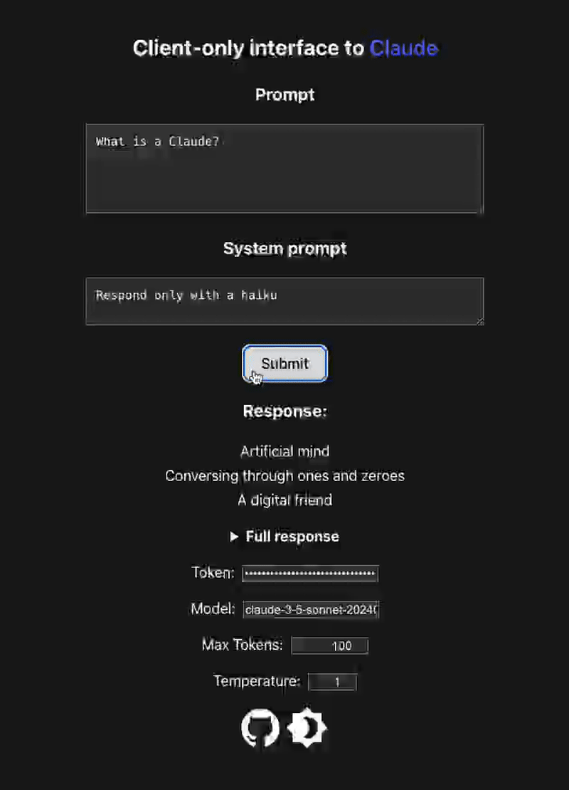

# Client-side Claude Client
A [Claude] client on a static webpage (with optional API key, which doesn't leave the browser tab); [claude.runsascoded.com]:

[][claude.runsascoded.com]

Inspired by [Claude’s API now supports CORS requests, enabling client-side applications].

[Claude’s API now supports CORS requests, enabling client-side applications]: https://simonwillison.net/2024/Aug/23/anthropic-dangerous-direct-browser-access/
[claude.runsascoded.com]: https://claude.runsascoded.com
[Claude]: https://claude.ai/
